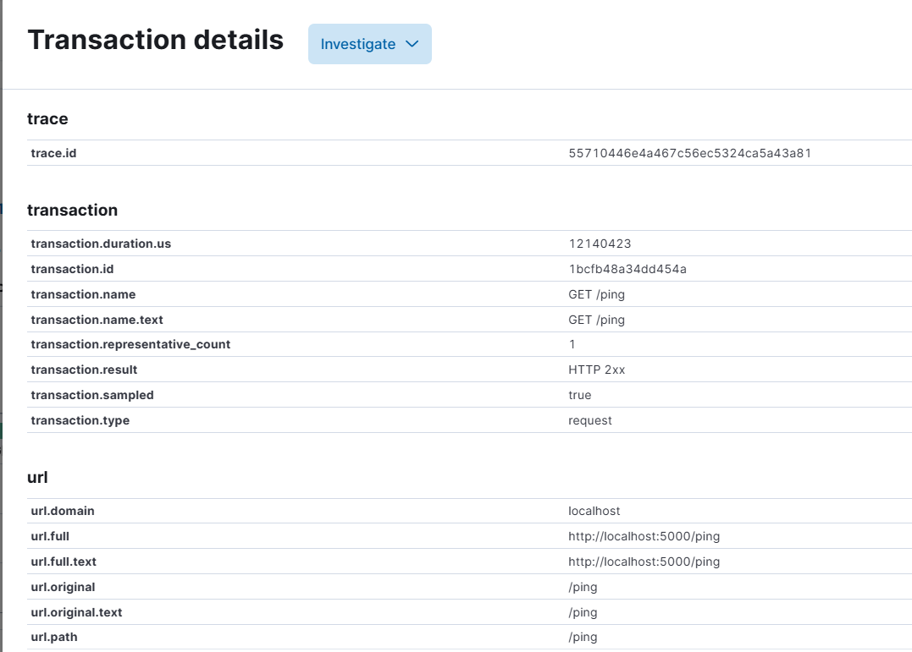
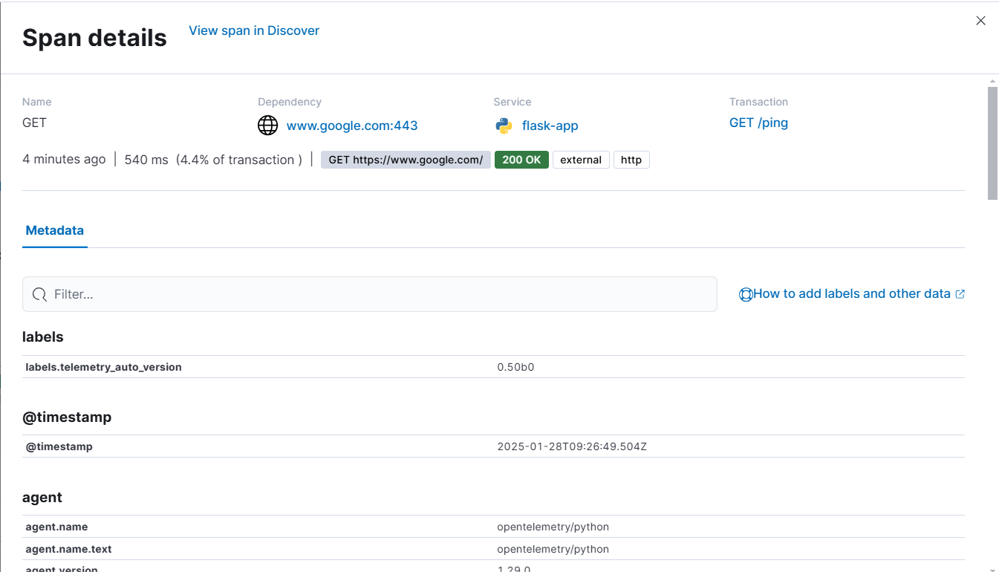
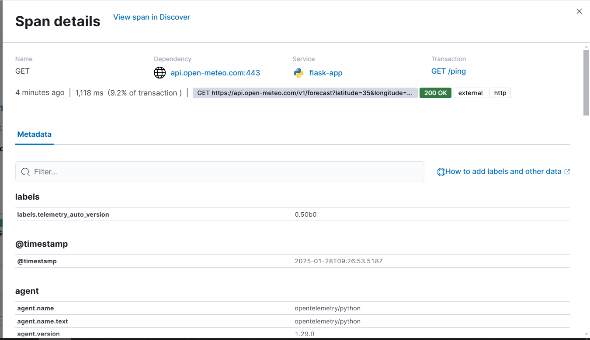

 Install docker in your local and try out docker compose.


## 1. Docker Compose Commands
Run the services defined in your `docker-compose.yml`:
```bash
docker-compose build --no-cache
docker-compose up 
docker-compose down
```

## 2. Head to kibana URL to see telemetry data
http://localhost:5601/app/apm/services/flask-app/

## 3. View the Flame Graph (Trace a Specific Application)
### To trace a particular application route: Head to flask-app -> transactions -> your app route
### a. Navigate to the Flask App -> Transactions -> Your app route.
- Here is an example flame graph for the route. We used auto-instrumentation for Flask and the requests library to capture traces for a specific endpoint.
<p align="center">
  
</p>


<br>
<br> 

### b. The image below displays all the metadata for the request, showing the telemetry data captured during the request's creation.
<p align="center">
  
</p>

<br>
<br> 

### c. Below is the telemetry data for the first call to another microservice.(In this is its just curl request to google)
<p align="center">
  
</p>

<br> 
<br>

### d. Below is the telemetry data for the second call to another microservice, which is a cURL request for the weather forecast.
<p align="center">
  
</p>

<br>
<br>

## 4. View the Flame Graph for error produced


