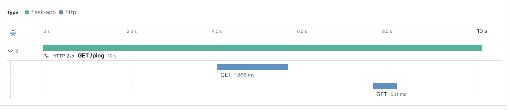

 install docker in your local and try out docker compose.


## Docker Compose Commands
Run the services defined in your `docker-compose.yml`:
```bash
docker-compose build --no-cache
docker-compose up 
docker-compose down

## head to kibana URL to see telemetry data
http://localhost:5601/app/apm/services/flask-app/

## to see the flame graph. head to flask-app -> transactions -> your app route



